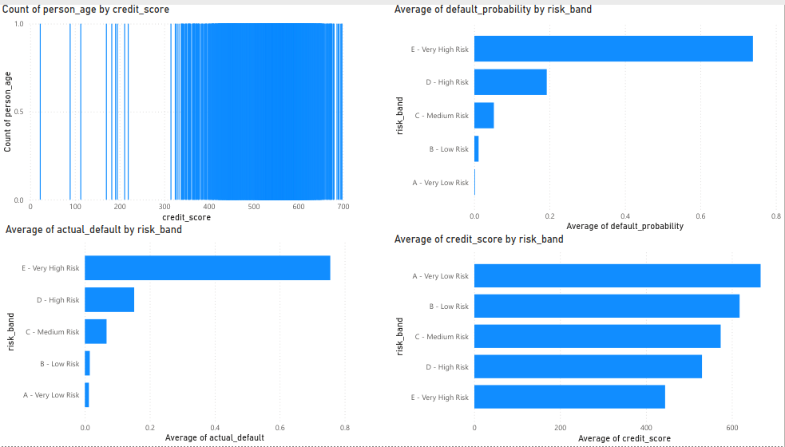

# Credit Risk Scoring Model

An end-to-end credit risk model built in Python, following industry
standards used in bank credit risk departments.

---

## Results Summary

| Metric | Score |
|---|---|
| Accuracy | 88.55% |
| AUC Score | 0.8864 |
| Gini Coefficient | 0.7727 |
| KS Statistic | 0.6486 |
| Portfolio Default Rate | 21.87% |

All metrics above industry benchmarks.

---

## Risk Band Performance

| Band | Default Rate |
|---|---|
| A - Very Low Risk | 1.23% |
| B - Low Risk | 1.51% |
| C - Medium Risk | 6.68% |
| D - High Risk | 15.19% |
| E - Very High Risk | 75.55% |

---

## Project Structure
credit-risk-model/
├── data/
│   └── credit_risk_dataset.csv
├── notebooks/
│   └── credit_risk_analysis.ipynb
├── outputs/
│   ├── model_results.csv
│   ├── scorecard.csv
│   ├── risk_band_summary.csv
│   └── charts/
├── powerbi/
│   └── dashboard.png
└── README.md

---

## Methodology

### Data
- 32,581 loan applicants from Kaggle
- 12 raw features, expanded to 26 after feature engineering
- Missing values imputed, outliers Winsorised
- 180 duplicate rows removed

### Feature Engineering
- Debt-to-Income ratio
- Income per year of employment
- High loan ratio flag (loan > 30% of income)

## Information Value (Feature Predictiveness)

| Feature | IV Score | Strength |
|---|---|---|
| debt_to_income | 0.9117 | Very Strong |
| loan_percent_income | 0.8887 | Very Strong |
| loan_int_rate | 0.6379 | Very Strong |
| person_income | 0.4865 | Strong |
| loan_amnt | 0.0837 | Weak |
| income_per_emp_year | 0.0830 | Weak |
| person_emp_length | 0.0611 | Weak |
| person_age | 0.0136 | Useless |
| cb_person_cred_hist_length | 0.0045 | Useless |

IV > 0.3 = strong predictor. Debt-to-income ratio is the most predictive feature.
### Model
- Logistic Regression (industry standard for credit scorecards)
- 80/20 train/test split with stratification
- StandardScaler normalisation
- 25 features, 1000 max iterations

### Scorecard
- Converted logistic regression to points-based scorecard
- Base score 600, 20 points to double the odds (PDO)
- Odds of 50:1 at base score
- 5 risk bands from A (Very Low Risk) to E (Very High Risk)

### Evaluation
- Confusion matrix
- ROC curve and AUC score
- Gini coefficient (2 x AUC - 1)
- KS statistic (Kolmogorov-Smirnov test)

---

## Key Findings

- Debt-to-income ratio is the strongest default predictor (coefficient 1.67)
- Loan grade is highly predictive — Grade G defaults 98.4% of the time
- Renters default at 31.6% vs homeowners at 7.5%
- Debt consolidation loans have the highest default intent rate (28.7%)
- Credit score clearly separates risk — Band A (1.2%) vs Band E (75.5%)

---

## Model Performance Detail

| Metric | Value |
|---|---|
| True Negatives | 4,845 |
| True Positives | 894 |
| False Positives | 218 |
| False Negatives | 524 |

---

## Dashboard

---

## Tech Stack

- Python 3.13
- pandas, numpy, scikit-learn
- matplotlib, seaborn
- Jupyter Notebook
- Power BI Web

---

## Dataset

Kaggle — Credit Risk Dataset by laotse
https://www.kaggle.com/datasets/laotse/credit-risk-dataset

---

## Author

Built for UBS Quantitative Risk Modelling internship application.
